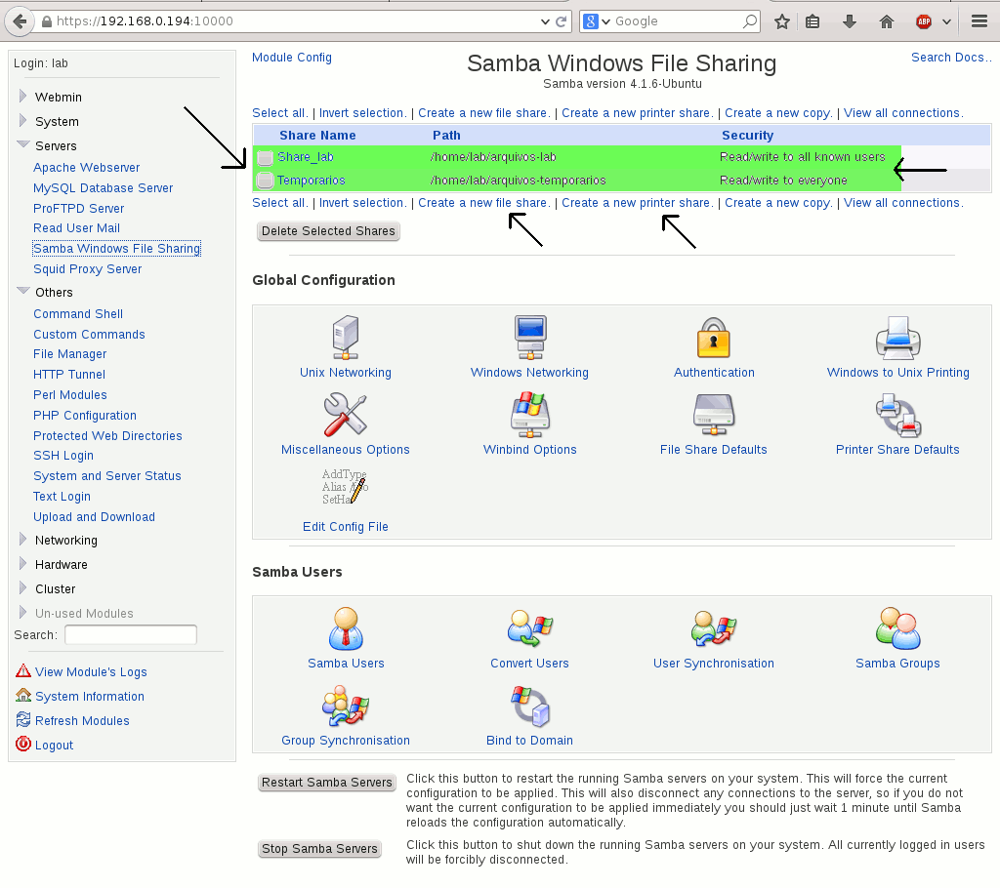
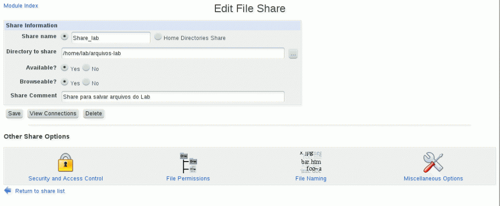

# SAMBA

## Gerenciando o Servidor Samba pelo Webmin

Olá pessoal, olha eu aqui de novo…com mais um artigo sobre esta ferramenta fantástica, o Webmin.

Desta vez, iremos ver como gerenciar nosso servidor de arquivos Samba, usando ele.

No último artigo, mostrei como instalar e criar compartilhamentos com o Samba, e desta vez vamos ver esta configuração já criada na console do Webmin.

Para isso você precisará já ter o seu Web Server instalado no Ubuntu 14.04, e o Webmin instalado e o Samba instalado.\
Você poderá conferir estas três tarefas estes artigos abaixo:

1 – [Instalando o WebServer](http://www.cleuber.com.br/index.php/2014/08/25/instalando-um-servidor-web-passo-a-passo-com-o-lamp-no-ubuntu-14-04)\
2 – [Instalando o Webmin](http://www.cleuber.com.br/index.php/2014/09/02/webmin-seu-portal-web-para-gerenciar-seu-linux)\
3 – [Servidor de Arquivos Samba](http://www.cleuber.com.br/index.php/2014/09/10/crie-seu-servidor-de-arquivos-com-samba-no-ubuntu-14-04)

Vou fazer um overview bem simples mesmo, sem entrar em todas as opções, fazendo apenas o que precisaremos para criar e gerenciar compartilhamentos, usuários, grupos, permissões e etc.

Bom, então vamos começar?

#### 1 -Visão Geral da Página de Administração do Samba

Acesse a console do Webmin pelo navegador e faça login.

https://Ip-do-seu-servidor:10000

Vá até a seção Un-used modules e procure pelo item “Samba Windows File Sharing”. Ele abrirá esta tela.

Repare na imagem abaixo um painel de controle completo para gerenciar o seu servidor samba com opções do básico ao avançado.

Muito legal não?!

Repare também que nossos compartilhamentos criados “a mão” estão listados aí, o caminho da pasta e o tipo de segurança. E botões abaixo do painel para parar ou reiniciar o serviço do Samba

_Obs. Depois de acessar esta tela, acesse o link “module config” e salve sem alterar nada e o item então aparecerá no menu da barra lateral “Servers”, conforme a imagem acima mostra._

#### 2 -Verificando Opções do Compartilhamento criado

Vamos clicar sobre o nome de um destes dois compartilhamentos para ver as propriedades dele.

Repare que a maioria daquelas configurações do arquivo “smb.conf” estão presentes de forma gráfica na imagem acima.

—————————————–\
\[Share\_lab] comment = Share para salvar arquivos do Lab\
path = /home/lab/arquivos-lab\
browseable = yes\
read only = no\
guest ok = no\
valid users = @arquivos-lab\
——————————————-

As demais configurações você poderá conferir clicando no ícone do cadeado “Security and Access Control” logo abaixo desta tela, conforme você pode ver na imagem abaixo.

#### 3 – Criando um novo Share

Voltando para a página Inicial do Samba, vamos agora criar um novo compartilhamento, conforme imagem abaixo

Agora, preencha os campos:

**Share Name:** Nome do compartilhamento\
**Directory to Share:** caminho da pasta que será criada,\
**Automatically create directory:** Deixe mercada esta opção para criar a pasta\
**Create with owner:** Vamos usar o usuário do samba que criamos, chamado “arquivos”\
**Create with permissions:** Vamos usar 777, para ter permissão de gravar dentro da pasta,\
**Create with group:** Vamos usar o grupo arquivos-lab que criamos previamente.\
**Avaliable:** Disponível, opção yes\
**Browsable:** Navegável, opção yes.

E clique em “**Create**” conforme imagem abaixo:

Depois de criar este compartilhamento observe só ele na lista:

Veja que nas permissões dele, está escrito “Read only to all know users” (apenas leitura para todos os usuários conhecidos).\
Por isso ele ainda não tem permissão de gravação na pasta. Se você então tentar colar ou criar um arquivo ou pasta  dentro deste compartilhamento com certeza aparecerá uma mensagem como esta:

Então para dar acesso de gravação a pasta, acesse a lista novamente, clique sobre o nome do seu novo compartilhamento, depois clique sobre o ícone “Security and Access Control”

Então mude a opção “Writable” (gravável), para YES.

Repare que agora ele mudou o texto de “Read only” para “Read/Write”, ou seja, leitura e gravação.

**Compartilhamento com Acesso Convidado**

Caso queira criar um compartilhamento com acesso sem autenticação {chamado de “Guest” (convidado)}, basta clicar no nome de seu compartilhamento e depois clique sobre o ícone “Security and Access Control” e mude a opção de “Guest Access?” para YES, conforme a imagem abaixo.

Bom, mas eu vou manter este Share, sem guest, pois já tenho um outro que é guest.

#### 4 – Testando

Agora iremos testar no Windows se o compartilhamento foi criado. E olha ele aí!

Ao acessar a pasta, ele pedirá usuário e senha, então iremos usar a que criamos previamente.

E pronto aqui está.\
Criei uma pasta dentro para ilustrar que o compartilhamento está com permissão de gravação.

Bom, vamos ver como ficou a configuração no nosso arquivo smb.conf

Vamos voltar para a página principal do Samba e clicar em “Edit Config File”

Repare na imagem abaixo que o compartilhamento que criamos através do Webmin, está no arquivo de configuração do Samba. E por aqui você pode alterar o que quiser, sem precisar acessar remotamente o servidor. 

#### 5 – Outras Opções

Não entrarei em detalhes, mas você poderá configurar também através do Webmin:

* Criar usuários do Samba
* Converter usuários do Samba para usuários do sistema
* Configurar a sincronização dos usuários
* Configurar a sincronização dos grupos
* Vincular-se à um servidor de Domínio
* Parar ou reiniciar o serviço
* …E muitas outras configurações globais do Samba.

**Monitorando os Serviços**

Você ainda poderá checar o status dos serviços instalados em seu servidor, no menu da lateral, Others, System and Server Status.

####

#### Conclusão

Agora você pode através do Webmin, criar e gerenciar compartilhamentos, criando automaticamente a pasta deles, gerenciar as permissões de acesso, usuários e grupos, editar a configuração do Samba diretamente pela console, entre muitas outras opções.
